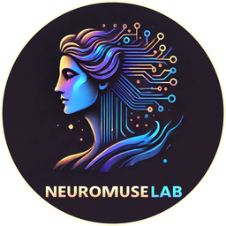

<p align="center"></p>
<h1 align="center">NeuroMuseLab</h1>
<p align="center">Публикуйте один или несколько MP3 в Telegram-канал через собственного бота.</p>
<p align="center"><a href="README.en.md">English</a> · <a href="https://github.com/Frommer-droid/NeuroMuseLab-App-Public/releases/latest">Последний релиз</a></p>

NeuroMuseLab — настольное приложение для владельца Telegram-канала. Оно проверяет доступ бота, отправляет треки по очереди и при необходимости добавляет обложку, текст и кнопку с вашей ссылкой.

## Быстрый старт

1. Скачайте `NeuroMuseLab_v0.7.0_Setup.exe` со [страницы последнего релиза](https://github.com/Frommer-droid/NeuroMuseLab-App-Public/releases/latest) и установите приложение.
2. Создайте бота через `@BotFather`, добавьте его администратором канала и разрешите публикацию сообщений.
3. Введите токен и `@username` канала либо его числовой `chat_id`. Нажмите «Проверить доступ».
4. Выберите MP3, при желании обложку и текст, затем нажмите «Опубликовать пост».

Поле ссылки для кнопки необязательное. Если оставить его пустым, публикация не содержит кнопку доната. Значение сохраняется только в личном `settings.json`.

## Возможности

- Один трек или несколько треков в отдельных аудиосообщениях.
- Одна обложка перед аудио и текст после него, если обложка выбрана.
- Автоматическое разделение длинного текста по лимиту Telegram.
- Отправка в фоновом потоке и сохранение полей формы и масштаба интерфейса.

## Запуск из исходников

Проверенная среда разработки — Windows и Python 3.12. Код требует Python 3.10 или новее.

```powershell
py -3.12 -m venv .venv
.\.venv\Scripts\python.exe -m pip install -r requirements.txt
.\.venv\Scripts\python.exe main.py
```

Для сборки портативной папки установите PyInstaller в ту же `.venv` и запустите:

```powershell
.\.venv\Scripts\python.exe -m pip install pyinstaller
.\.venv\Scripts\python.exe Build_Tools\build_release.py
```

Сборщик проверяет происхождение native DLL и запускает отдельный неинтерактивный frozen smoke. Итоговая папка — `NeuroMuseLab/` в корне проекта. Подробности: [DEVELOPER.md](DEVELOPER.md).

## Локальные данные и ограничения

Приложение сохраняет токен бота, канал, ссылку, последние файлы и состояние окна в `settings.json` **без шифрования**. У установленной версии личные данные находятся в `%APPDATA%\NeuroMuseLab`; при запуске из исходников или переносимой папки — рядом с программой. Там же находится `logs/session.log`. Защитите эти файлы и не передавайте их другим людям. Они исключены из Git и релизной сборки.

Для отправки нужны интернет, бот с правом публикации в канале и доступ к Telegram API. Поддерживаются аудиофайлы `.mp3`. История версий — в [RELEASE_NOTES.md](RELEASE_NOTES.md).

Собственный код проекта доступен по [лицензии MIT](LICENSE); сторонние зависимости сохраняют свои лицензии.
